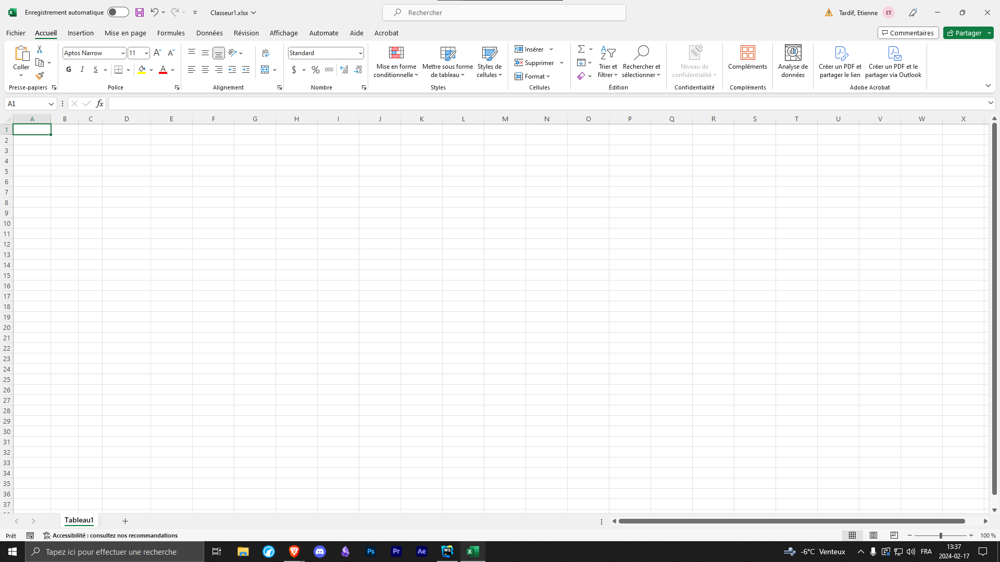
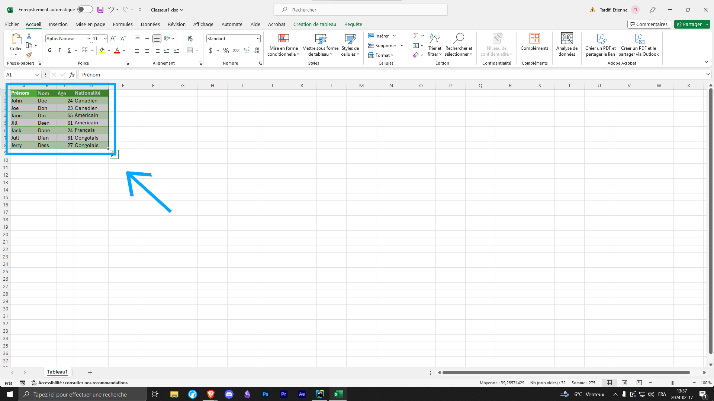
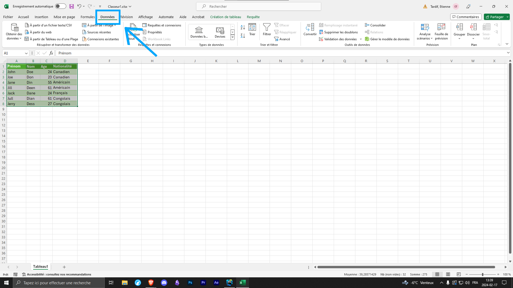
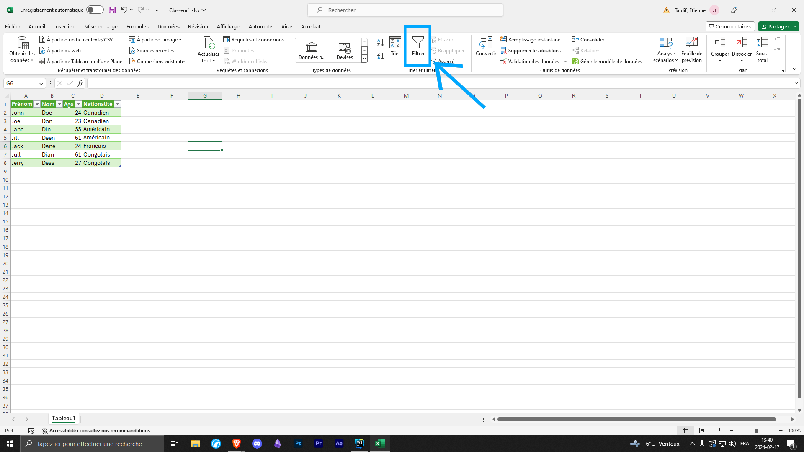
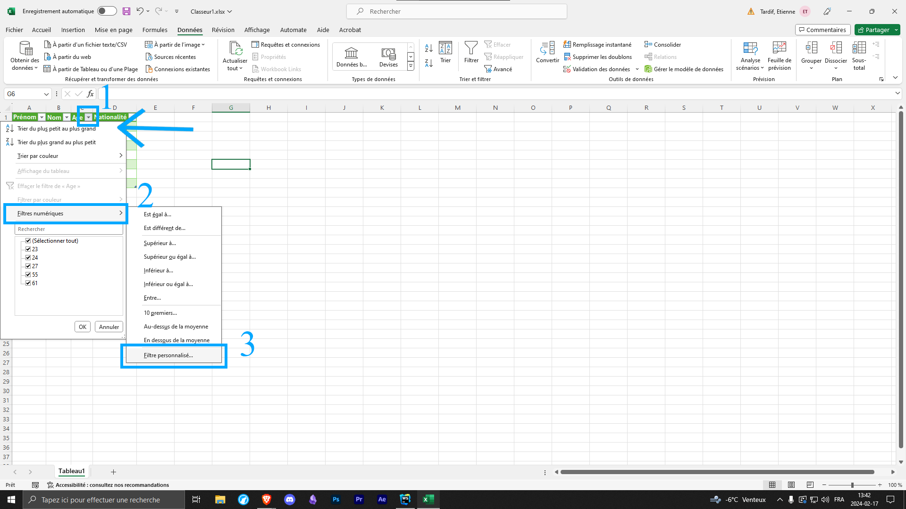
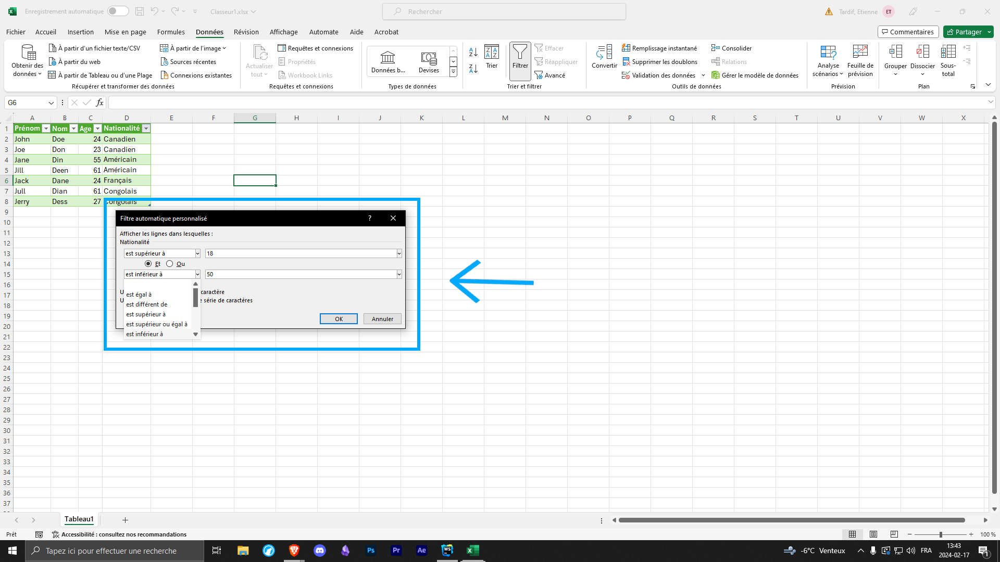
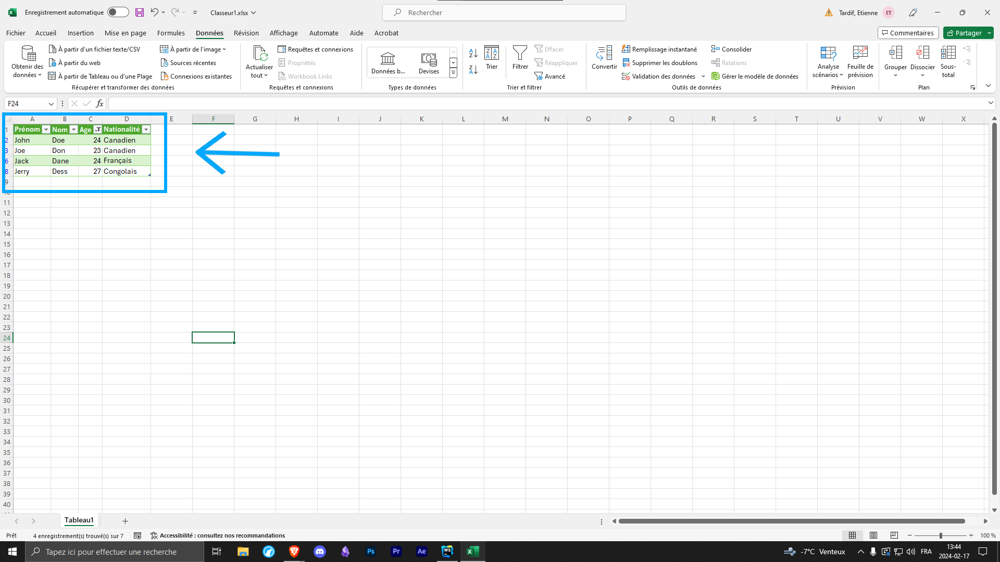

Par Etienne Tardif

En date du 8 février 2024

La procédure suivante vous guidera à travers les étapes pour ajouter des filtres personnalisés à un tableau dans Microsoft Excel.

:::info

Le processus prend environ 5 minutes.

Cette méthode est fonctionnelle en date du 8 février 2024 sous Windows 10 Home, version 22H2

:::

:::note

**Prérequis :**

Un ordinateur sous système d'exploitation sous Windows 10.

Excel de la suite Microsoft Office 365 ou Microsoft Office.
:::

---

## Étapes pour Ajouter des Filtres dans un Tableau :

### 1. Ouvrir le Document Excel :
Ouvrez votre document Excel excel vierge.

### 2. Créer un tableau :
Créer une plage de donnée puis sélectionner la plage de donnée. Assurez-vous que toutes les colonnes ont des en-têtes pour un filtrage plus efficace.

### 3. Accéder à l'onglet "Données" :
Dans le ruban en haut, accédez à l'onglet "Données".

### 4. Cliquer sur "Filtre" :
Dans le groupe "Trier et filtrer" (Sort & Filter), cliquez sur l'option "Filtre" (Filter). Des flèches de filtrage apparaîtront à côté des en-têtes de colonnes.

### 5. Utiliser les Filtres :
Cliquez sur la flèche à côté de la colonne à filtrer. Une liste déroulante s'affichera avec différentes options de filtrage. Sélectionnez les critères de filtre spécifique à votre colonne puis choisir dans le menu déroulant "Filtre Personnalisé".

### 6. Filtre Personnalisé :
Un menu contextuel devrait s'ouvrir, spécifier les informations relatives à votre filtre personnalisé (Supérieur à 18 et inférieur à 50 dans notre example) puis faire Ok.

### 7. Confirmation :
Après avoir terminé et approuvé votre filtre, vous ferez votre filtre s'appliquer sur le tableau créer.

