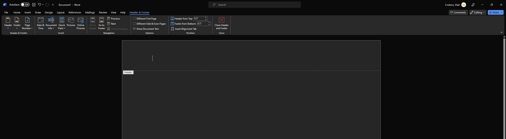
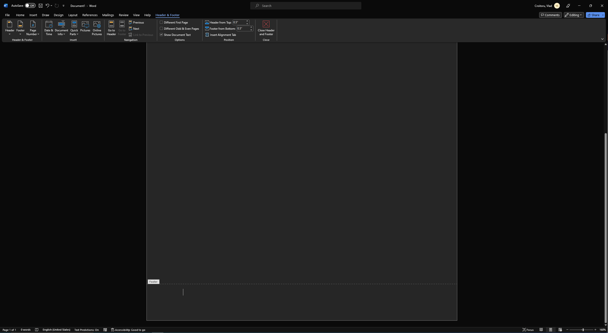
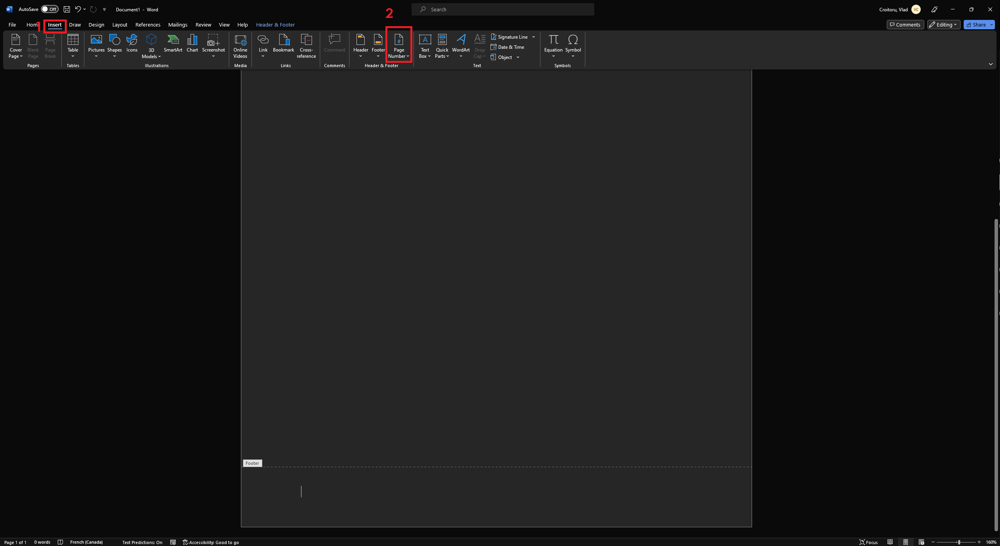
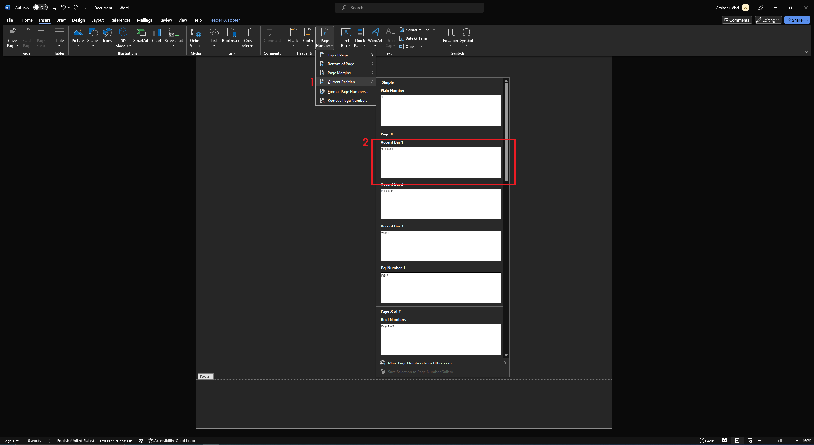
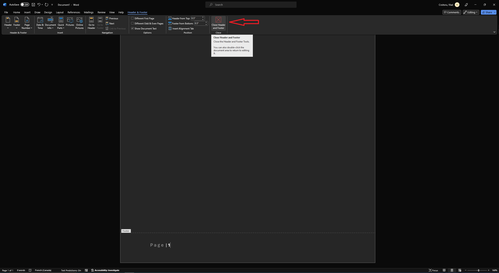

# Comment ajouter des numéros de page à un en-tête ou à un pied de page dans Word

Par Vlad Croitoru 11 février 2024

## Table des matières
1. [Introduction](#introduction)
2. [Ajouter des numéros de page à un en-tête ou à un pied de page](#ajouter)
3. [Modifier l'endroit où le numéro de page apparaît](#endroit)
4. [Modifier l'apparence du numéro de page](#apparence)

:::info

Le processus prend environ 3 minutes.

Cette méthode est fonctionnelle en date du 11 février 2024 sous Windows 10 Home, version 22H2

:::

:::note

**Prérequis :**

Un ordinateur sous système d'exploitation sous Windows 10.

Word de la suite Microsoft Office 365 ou Microsoft Office.
:::

## Introduction 

> Ce guide montre comment ajouter des numéros de page à un en-tête ou à un pied de page et modifier l'endroit ou 
> l'apparence des numéros de pages dans l'application Microsoft Word.

## Ajouter des numéros de page à un en-tête ou à un pied de page 

1. Double-cliquez dans l'en-tête ou le pied de page où vous souhaitez que les numéros de page aillent.

En-tête

Pied de page

2. Accédez à « Insert > Page Numbering ».

3. Sélectionnez « Current Position ».
4. Choisissez un style

5. Fermer l'outil « Header and Footer »

## Modifier l'endroit où le numéro de page apparaît 

1. Dans la zone d'en-tête ou de pied de page, sélectionnez le numéro de page.

2. Utilisez la touche Tab pour positionner le numéro de page à gauche, au centre ou à droite. Si le nombre est à gauche, appuyez
sur Tab une fois pour le centre et deux fois pour la droite. Pour revenir en arrière, appuyez sur Retour arrière jusqu'à ce qu'il soit en position.

## Modifier l'apparence du numéro de page 

1. Sélectionnez le numéro de page.
2. Accédez à Home > Font et à la boîte de dialogue des Polices pour modifier la famille de polices, le style, la taille et la couleur.