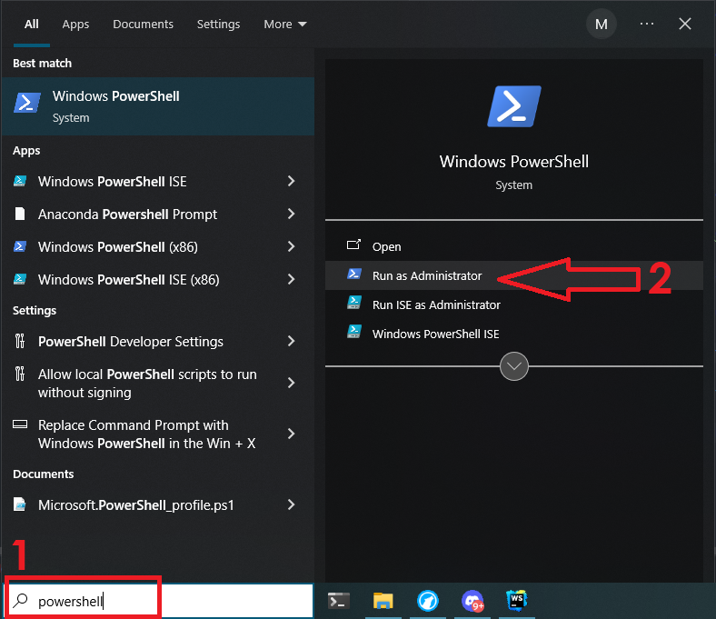
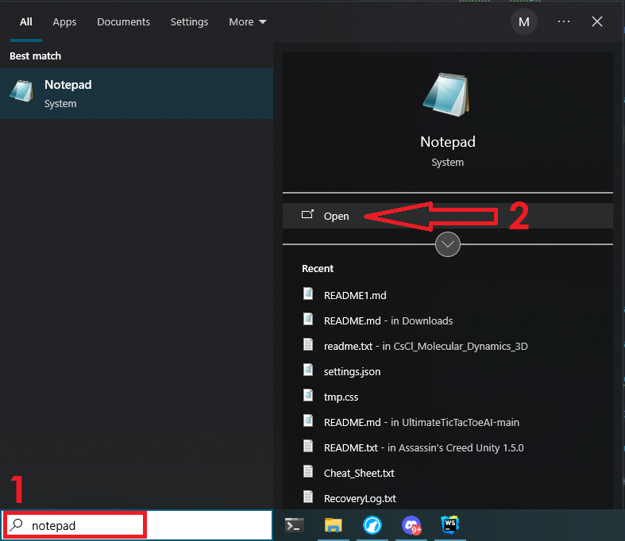
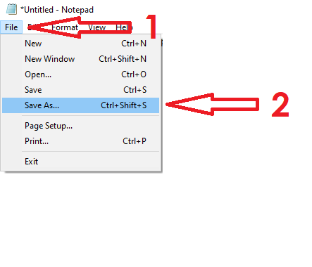
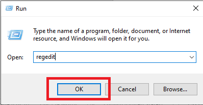
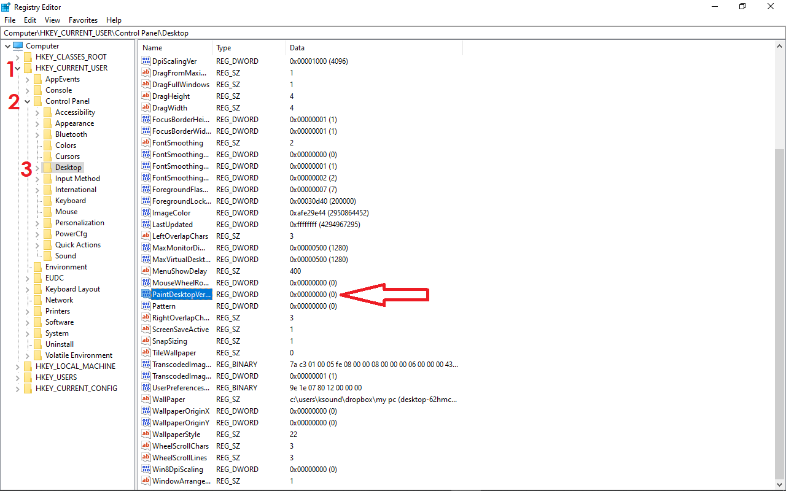
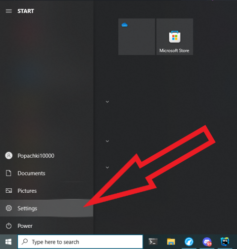
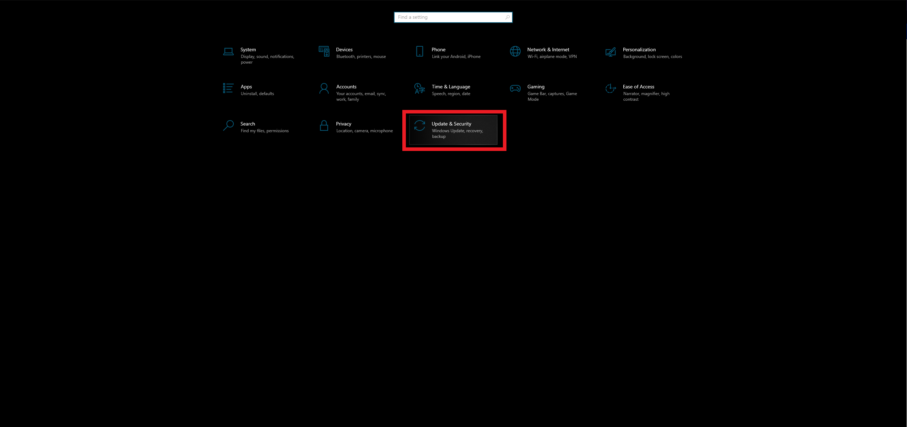

# Comment se débarrasser du message d'activation de Windows 10

Par Vlad Croitoru 7 février 2024

## Table des matières
1. [Introduction](#introduction)
2. [Suppression du message d'activation du PC Windows 10](#win10)
3. [Comment se débarrasser du message Activer Windows avec PowerShell](#powershell)
4. [Comment se débarrasser du message Activer Windows avec Notepad](#notepad)
5. [Comment se débarrasser du message Activer Windows avec l'éditeur du registre](#registre)
6. [Comment se débarrasser du message Activer Windows avec une clé de produit](#cle)

## Introduction 
> Si vous êtes un utilisateur Windows, vous avez peut-être vu le message « Activate Windows » qui s'affiche par-dessus tout, y compris votre curseur.

> Ce message s'affiche lorsque vous utilisez un système d'exploitation Windows dont la licence est non valide ou expirée.

> Ce guide montre quatre manières différentes pour se débarrasser du message « Activate Windows ».

## Suppression du message d'activation du PC Windows 10 
### Comment se débarrasser du message Activer Windows avec PowerShell 

##### 1. Appuyez sur WIN (touche de logo Windows) + S sur votre clavier.
##### 2. Recherchez « powershell ». Vous devez exécuter le script en tant qu'administrateur, alors cliquez sur « Run as Administrator » à droite.

#### 3. Tapez « slmgr /renew » (sans guillemets) et appuyez sur ENTRÉE.

##### 4. Redémarrez votre PC.

### Comment se débarrasser du message Activer Windows avec Notepad 

##### 1. Appuyez sur WIN (touche de logo Windows) + S sur votre clavier et écrivez notepad.

##### 2. Assurez-vous que vous travaillez avec un nouveau fichier. Collez dans le script ci-dessous :

`@echo off taskkill /F /IM explorer.exe explorer.exe exit`

##### 3. Cliquez sur Fichier dans le menu et sélectionnez « Save as ».

##### 4. Nommez le fichier « remove.bat » et sélectionnez « All files » comme format. Ensuite, enregistrez le fichier

##### 5. Localisez le fichier et faites un clic droit dessus, puis sélectionnez « Run as administrator ».

##### 6. Redémarrez votre PC.

### Comment se débarrasser du message Activer Windows avec l'éditeur du registre 

##### 1. Appuyez sur WIN (touche de logo Windows) + R sur votre clavier et écrivez « regedit », puis cliquez sur « OK ».

##### 2. Développez HKEY_CURRENT_USER, « Control panel », puis cliquez sur « Desktop ».

##### 3. Localisez PaintDesktopVersion et double-cliquez dessus.

##### 4. Modifiez la valeur de 1 à 0 et cliquez sur « OK ».

##### 5. Redémarrez votre PC.

### Comment se débarrasser du message Activer Windows avec une clé de produit 

##### 1. Cliquez sur « Start » (l'icône Windows) et sélectionnez « Settings ».

##### 2. Choisissez « Updates & Security » dans les cases du menu.

##### 3. Passez à l'onglet « Activation » à gauche et cliquez sur « Change product key ».

