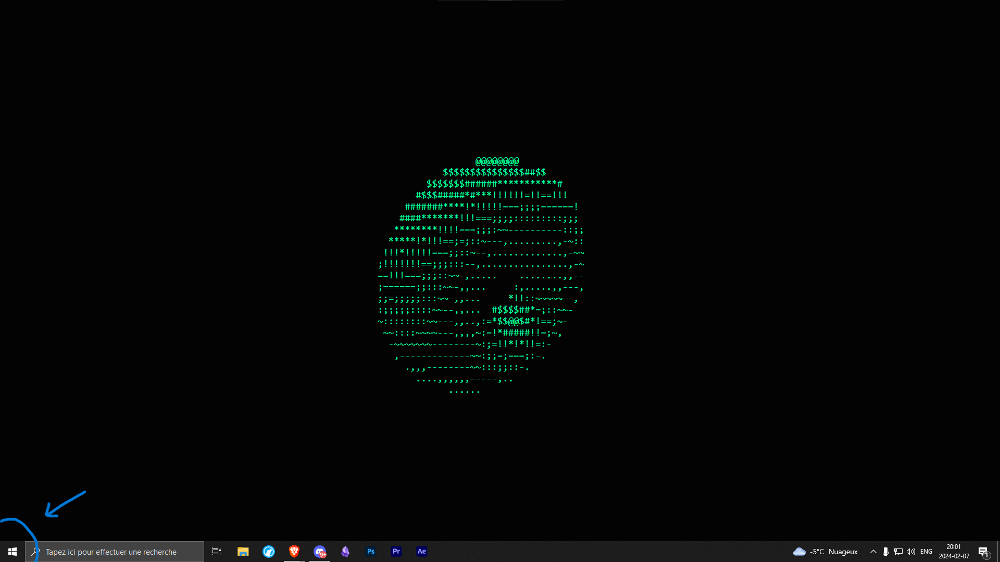
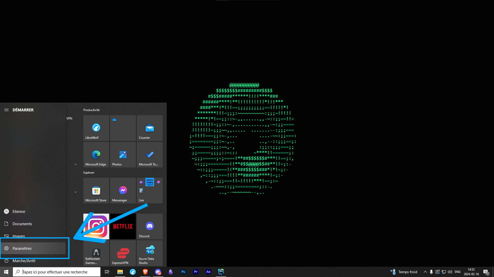
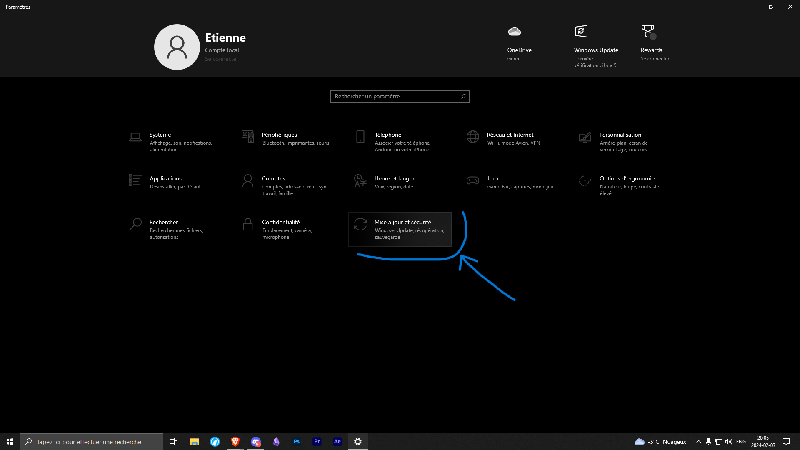
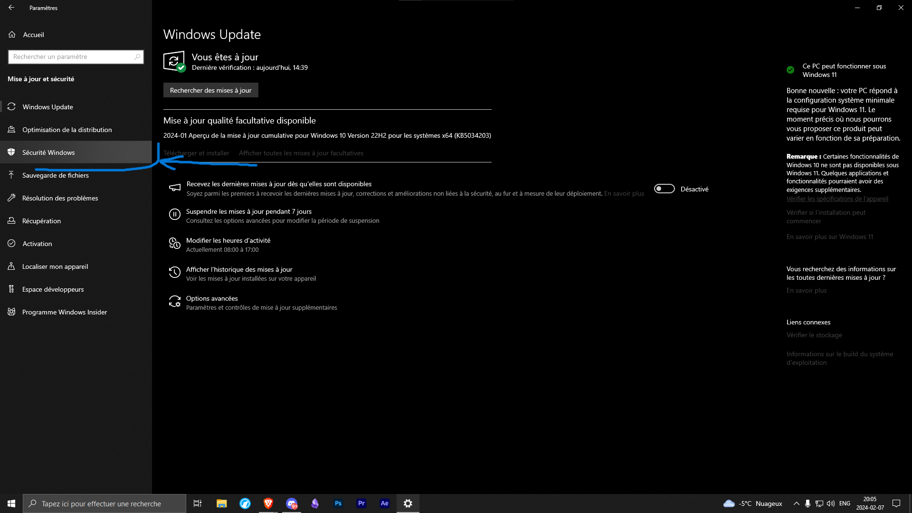
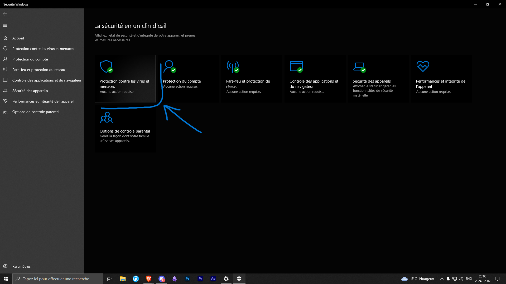
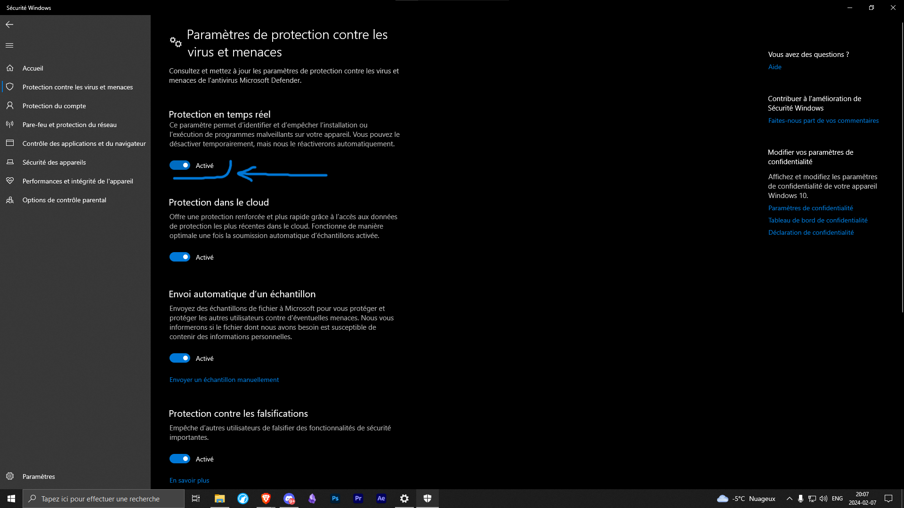
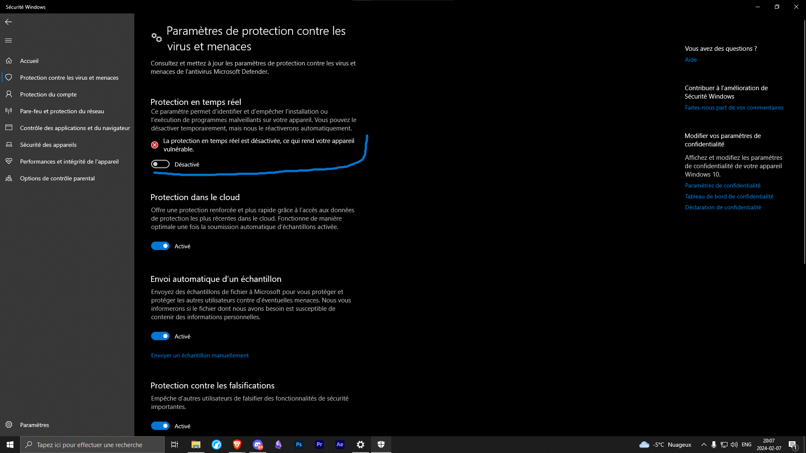

>  Le processus de désactivation prend environ 5 minutes.
> 
>  Cette méthode est fonctionnelle en date du 8 février 2024 sous Windows 10, version 22H2

## 1. Localiser le bouton Démarrer de Windows 10 :
Depuis votre bureau, trouvez le bouton Démarrer dans le coin inférieur gauche de votre écran ou appuyez sur la touche Windows (Win ) de votre clavier pour ouvrir le menu contextuel de Windows 10.

## 2. Accéder au menu des Paramètres de Windows 10 :
Localisez et cliquez sur le bouton engrenage dans le menu Démarrer. Alternativement, dans la barre de recherche, saisissez "Paramètres" et appuyez sur la recommandation paramètres.

## 3. Aller à l'onglet "Mise à jour et sécurité" :
Dans le menu des Paramètres, localisez et cliquez sur l'onglet "Mise à jour et sécurité".

## 4. Accéder à la section Sécurité Windows :
Dans l'onglet "Mise à jour et sécurité", vous devriez voir plusieurs options dans le menu contextuel sur le côté gauche. Localisez et cliquez sur "Sécurité Windows".

## 5. Accéder aux paramètres avancés de Sécurité Windows :
Dans la fenêtre de Sécurité Windows, localisez et cliquez sur l'option "Ouvrir Sécurité Windows".

## 6. Accéder aux paramètres de protection contre les virus et menaces :
Dans la fenêtre d'accueil de Sécurité Windows, localisez et cliquez sur l'option "Protection contre les virus et menaces".

## 7. Accéder aux paramètres avancés de protection contre les virus et menaces :
Vous verrez une section appelée "Paramètres de protection contre les virus et menaces". Sous celle-ci, localisez et cliquez sur l'option "Gérer les paramètres".

## 8. Désactiver la protection en temps réel de Windows Defender :
Dans la fenêtre de Paramètres de protection contre les virus et menaces, localisez et désactivez l'option "Protection en temps réel" pour désactiver Windows Defender.

## 9. Confirmation de la désactivation :
Dans la fenêtre au-dessus de l'option "Protection en temps réel" une confirmation spécifiant que la protection en temps réel de Windows Defender est désactivé devrait apparaitre.

> ⚠ **AVERTISSEMENT :** La désactivation de Windows Defender peut rendre votre système vulnérable aux menaces. Nous vous recommandons vivement de maintenir la protection en temps réel activée pour assurer la sécurité de votre ordinateur. Si vous choisissez de désactiver Windows Defender, veuillez vous assurer d'avoir une alternative de sécurité fiable installée et activée sur votre système.
>
> En désactivant Windows Defender, vous prenez la responsabilité de la sécurité de votre système et des éventuelles conséquences liées aux menaces potentielles. Nous déclinons toute responsabilité pour tout dommage, perte de données ou autre impact sur votre système résultant de la désactivation de Windows Defender.
>
> Assurez-vous de réactiver Windows Defender dès que possible ou de mettre en place une alternative de sécurité adéquate pour protéger votre ordinateur.
